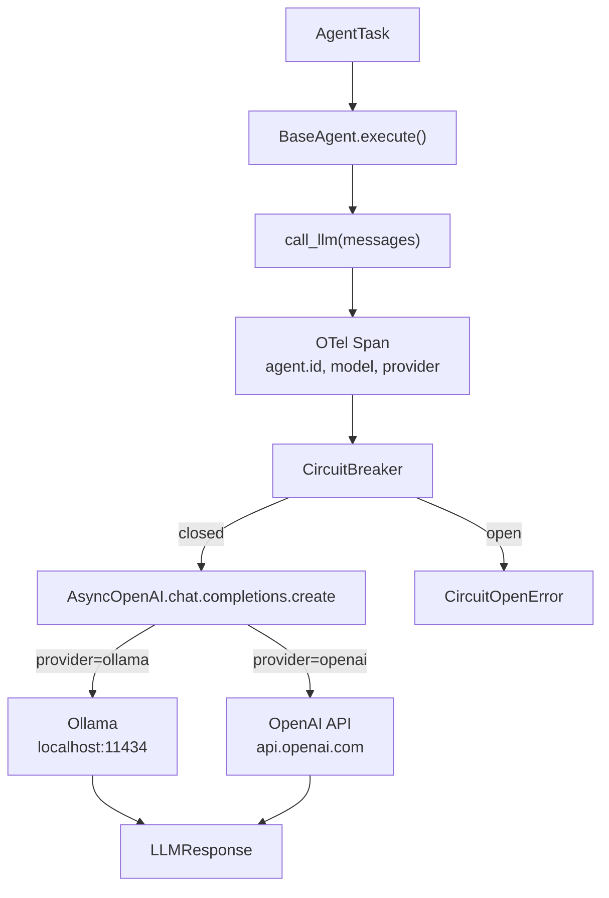
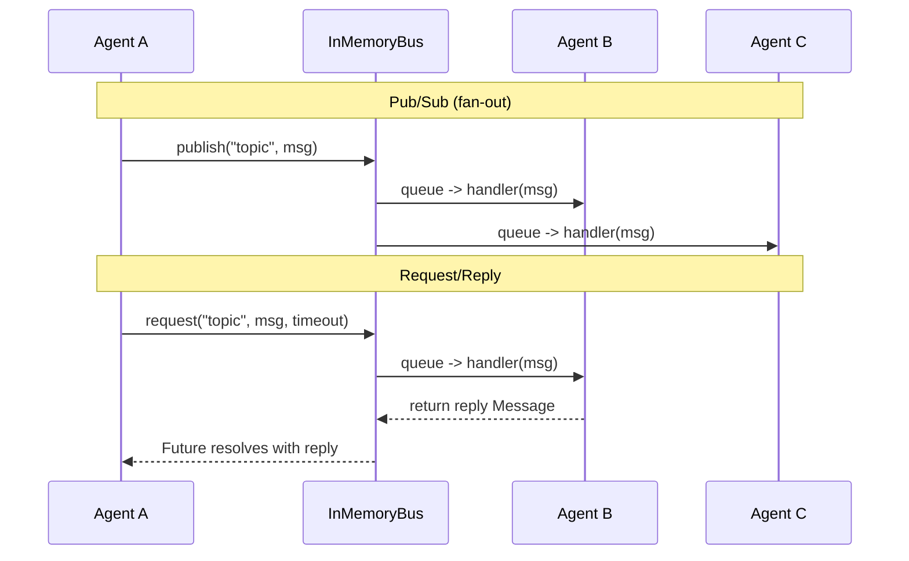
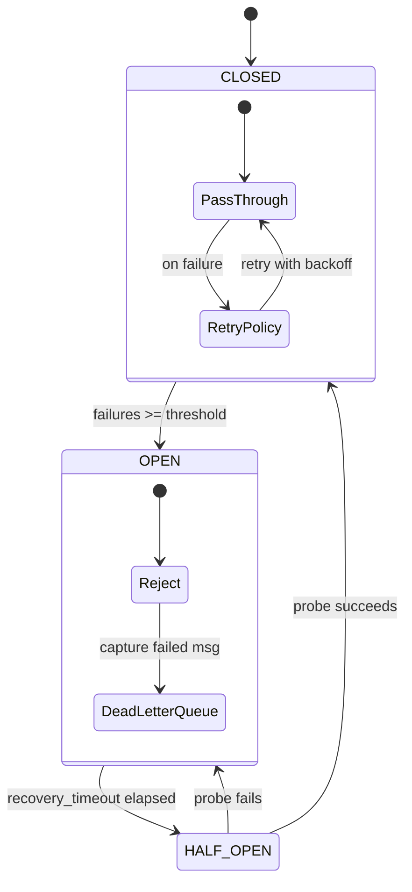
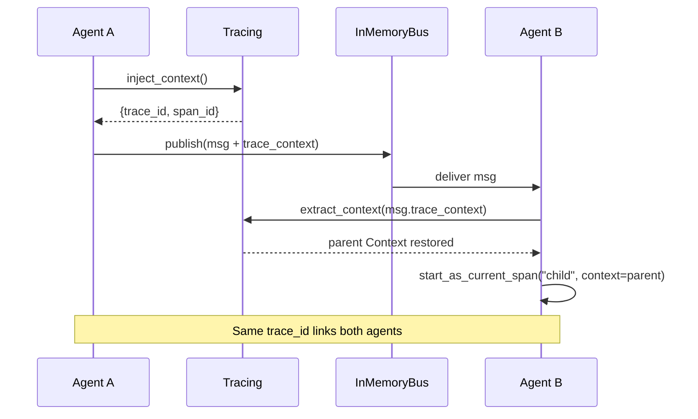

# Architecture Diagrams

## 1. How an Agent Talks to an LLM

The core flow: any agent calls an LLM through a resilient, traced pipeline.

```
  AgentTask ──> BaseAgent.execute()
                     |
                call_llm(messages)
                     |
            ┌────────┴────────┐
            │  OpenTelemetry  │  create span, set agent.id/model/provider
            │     Span        │
            └────────┬────────┘
                     |
            ┌────────┴────────┐
            │ CircuitBreaker  │  closed ──> pass through
            │                 │  open   ──> reject (CircuitOpenError)
            └────────┬────────┘
                     |
            AsyncOpenAI(base_url, api_key)
            chat.completions.create(model, messages)
                   /          \
       ┌──────────┘            └──────────┐
       │  provider="ollama"               │  provider="openai"
       │  localhost:11434/v1              │  api.openai.com/v1
       │  qwen3-coder, gemma4, ...       │  gpt-4o-mini
       └──────────┐            ┌──────────┘
                   \          /
              LLMResponse(content, usage, model, provider)
```



## 2. Agent-to-Agent Communication via Message Bus

Agents don't call each other directly. They communicate through a queue-backed async message bus with pub/sub and request/reply.

```
  Agent A                    InMemoryBus                    Agent B
    |                            |                            |
    |  publish("topic", msg)     |                            |
    |──────────────────────────>│|                            |
    |                       ┌───┴───┐                         |
    |                       │ Queue │──> handler(msg) ───────>│
    |                       └───────┘                         |
    |                       ┌───────┐                         |
    |                       │ Queue │──> handler(msg) ───> Agent C
    |                       └───────┘                         |
    |                                                         |
    |  request("topic", msg, timeout=5)                       |
    |──────────────────────────>│                              |
    |                       ┌───┴───┐                         |
    |                       │ Queue │──> handler(msg)          |
    |                       │Future │<── return reply_msg ────│
    |<──────────────────────│result │                          |
    |  reply Message        └───────┘                         |
```



## 3. Resilience: What Happens When Things Fail

Circuit breaker, retries, and dead letter queue work together to handle failures.

```
                         Agent calls LLM
                              |
                     ┌────────┴────────┐
                     │  RetryPolicy    │  max_retries=3
                     │  exp. backoff   │  base_delay * 2^attempt + jitter
                     └────────┬────────┘
                              |
                     ┌────────┴────────┐
                     │ CircuitBreaker  │
                     └────────┬────────┘
                           /  |  \
                      ┌───┘   |   └───┐
                 CLOSED    HALF_OPEN   OPEN
                 pass      probe (1)   reject all
                 through   success?    ──> CircuitOpenError
                    |       /    \
                    |    yes      no
                    |     |       |
                    |  CLOSED    OPEN
                    |             |
                    v             v
               success     failure ──> DeadLetterQueue
                                        |
                                   ┌────┴────┐
                                   │ capture  │  store original msg + error
                                   │ retry()  │  re-publish to bus
                                   │ purge()  │  discard
                                   └─────────┘
```



## 4. Distributed Tracing Across Agent Boundaries

Trace context propagates through messages so you can see the full call chain in Jaeger/Phoenix.

```
  Agent A (Span: "parser.llm")
    |
    | inject_context()
    |  -> {trace_id: abc, span_id: 123}
    |
    | publish(msg with trace_context={trace_id: abc, span_id: 123})
    |──────────────────> InMemoryBus ──────────────────> Agent B
                                                          |
                                         extract_context(msg.trace_context)
                                           -> restore parent span
                                                          |
                                         start_as_current_span("scanner.llm",
                                             context=parent)
                                                          |
                                         trace_id == abc  (same trace!)
                                         span_id == 456   (new child span)
                                                          |
    ┌─────────────────────────────────────────────────────┘
    |
    v  What you see in the tracing UI:
    ┌──────────────────────────────────────────────────┐
    │ Trace abc                                        │
    │ ├── parser.llm (Agent A)         42ms            │
    │ │   └── openai.chat             38ms             │
    │ └── scanner.llm (Agent B)        67ms            │
    │     └── openai.chat             61ms             │
    └──────────────────────────────────────────────────┘
```


