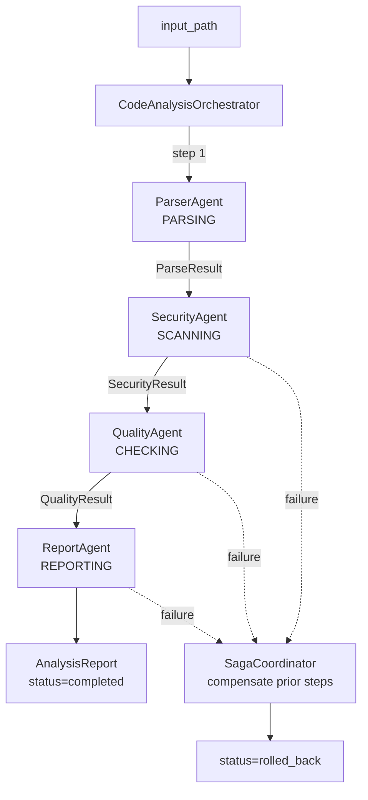
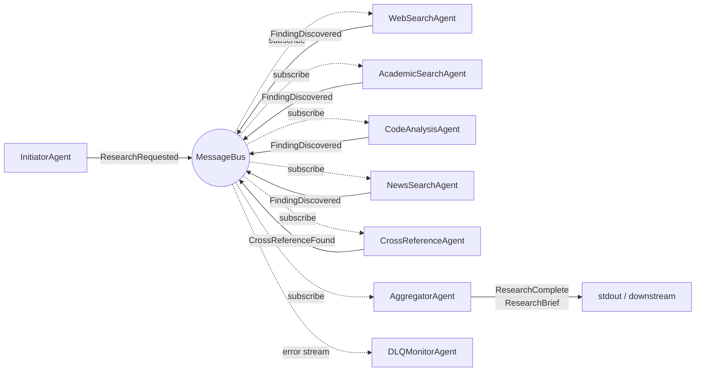
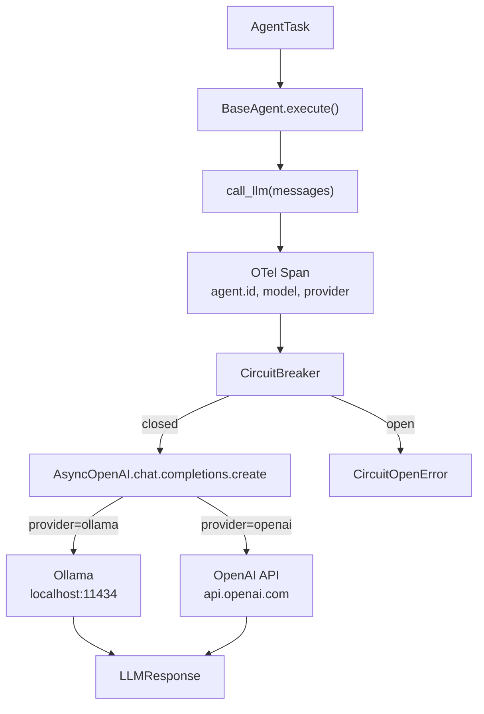
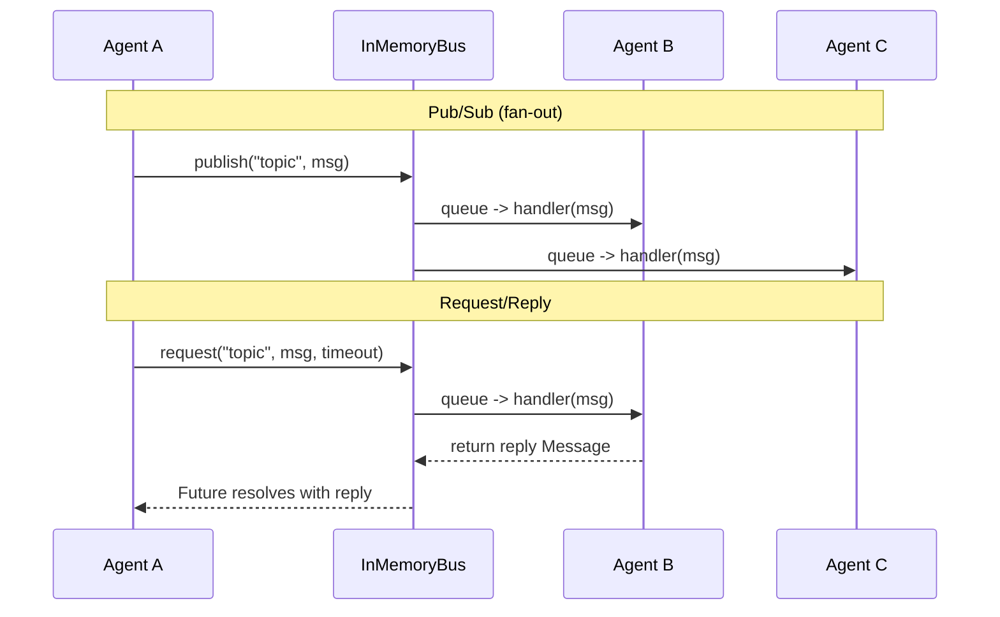
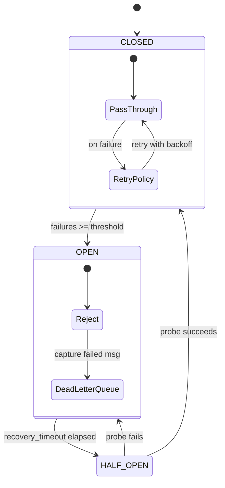
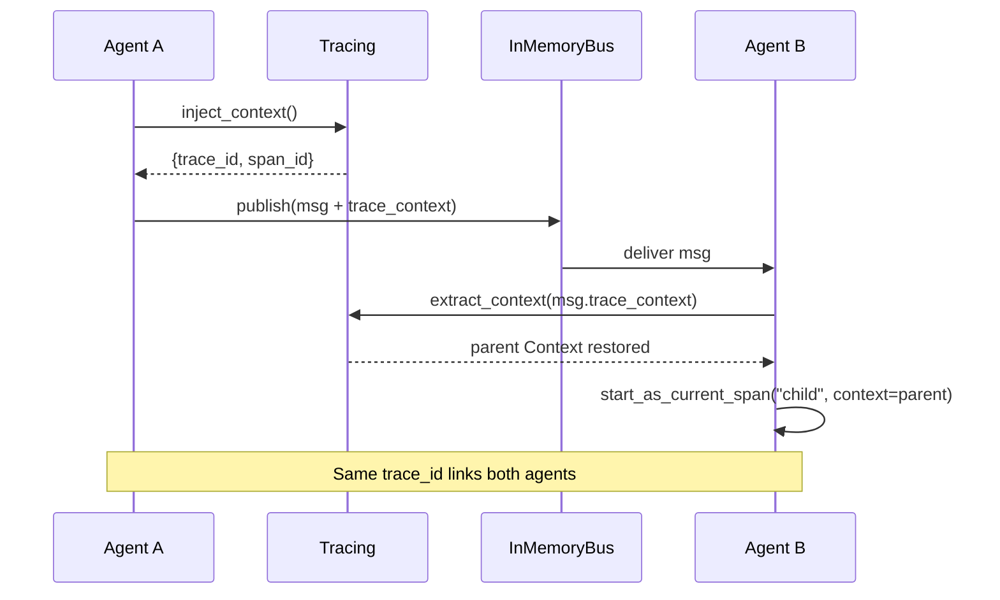

# Architecture Diagrams

## Orchestration — Sequential Code Analysis

A central `CodeAnalysisOrchestrator` drives four agents through a fixed pipeline. Each step's output is snapshotted; on failure, a `SagaCoordinator` rolls back completed steps in reverse order. The pattern is *centralised control, explicit state machine, compensating transactions*.

```
                  Input file path
                        │
                        ▼
        ┌──────────────────────────────────┐
        │  CodeAnalysisOrchestrator         │
        │  state: PENDING → ... → COMPLETED │
        │  saga: snapshot after each step   │
        └────────┬─────────────────────────┘
                 │  run_step(step, agent)
     ┌───────────┼───────────┬───────────┐
     ▼           ▼           ▼           ▼
  PARSING    SCANNING    CHECKING    REPORTING
  Parser     Security    Quality     Report
  Agent      Agent       Agent       Agent
     │           │           │           │
     └──── each: Agent.execute → Agent.llm span ────┘
                        │
                        ▼
        On failure at step N:
        SagaCoordinator.compensate(steps[:N])
        → rollback in reverse order → ROLLED_BACK
```



Key property: a single trace per run. Phoenix shows the pipeline root, one `Agent.execute` span per step, and one `Agent.llm` child span per agent (13 spans total in a healthy run).

## Choreography — Event-Driven Research Aggregation

No orchestrator. `InitiatorAgent` publishes `ResearchRequested`; four search agents subscribe *independently* and each publish `FindingDiscovered` when they have something. `CrossReferenceAgent` reacts to findings. `AggregatorAgent` accumulates and emits `ResearchComplete` + `ResearchBrief`. The pattern is *decentralised reaction, shared event stream, no direct calls between agents*.

```
  InitiatorAgent                MessageBus                   EventStore
       │                            │                            │
       │  ResearchRequested ───────>│ ──────────────────────────>│ append
       │                            │
       │        ┌───────────────────┼───────────────────┐
       │        │ fan-out subscribe │                   │
       │        ▼                   ▼                   ▼
       │   WebSearch           AcademicSearch       CodeAnalysis  + NewsSearch
       │   Agent               Agent                Agent          Agent
       │        │                   │                   │              │
       │        │   each: .llm span + _summarize_entries               │
       │        │   _build_finding_payload(summary=...)                │
       │        │                   │                   │              │
       │   FindingDiscovered   FindingDiscovered   FindingDiscovered  ...
       │        │                   │                   │              │
       │        └───────────────────┼───────────────────┘
       │                            ▼
       │                      CrossReferenceAgent
       │                            │
       │                       CrossReferenceFound
       │                            │
       │                            ▼
       │                      AggregatorAgent
       │                            │
       │                     ResearchComplete + ResearchBrief
       │
       └──── DLQMonitorAgent watches for AgentError / dead-letter events ─────
```



Key property: one trace per agent (not per run), linked by the `trace_context` field on events. No agent holds a reference to another — the structural invariant is enforced by `test_initiator_agent_has_no_direct_references_to_other_agents`.

---

## Core Infrastructure Diagrams

The diagrams below describe the shared plumbing that both patterns use — agents, bus, resilience, tracing.

## 1. How an Agent Talks to an LLM

The core flow: any agent calls an LLM through a resilient, traced pipeline.

```
  AgentTask ──> BaseAgent.execute()
                     |
                call_llm(messages)
                     |
            ┌────────┴────────┐
            │  OpenTelemetry  │  create span, set agent.id/model/provider
            │     Span        │
            └────────┬────────┘
                     |
            ┌────────┴────────┐
            │ CircuitBreaker  │  closed ──> pass through
            │                 │  open   ──> reject (CircuitOpenError)
            └────────┬────────┘
                     |
            AsyncOpenAI(base_url, api_key)
            chat.completions.create(model, messages)
                   /          \
       ┌──────────┘            └──────────┐
       │  provider="ollama"               │  provider="openai"
       │  localhost:11434/v1              │  api.openai.com/v1
       │  qwen3-coder, gemma4, ...       │  gpt-4o-mini
       └──────────┐            ┌──────────┘
                   \          /
              LLMResponse(content, usage, model, provider)
```



## 2. Agent-to-Agent Communication via Message Bus

Agents don't call each other directly. They communicate through a queue-backed async message bus with pub/sub and request/reply.

```
  Agent A                    InMemoryBus                    Agent B
    |                            |                            |
    |  publish("topic", msg)     |                            |
    |──────────────────────────>│|                            |
    |                       ┌───┴───┐                         |
    |                       │ Queue │──> handler(msg) ───────>│
    |                       └───────┘                         |
    |                       ┌───────┐                         |
    |                       │ Queue │──> handler(msg) ───> Agent C
    |                       └───────┘                         |
    |                                                         |
    |  request("topic", msg, timeout=5)                       |
    |──────────────────────────>│                              |
    |                       ┌───┴───┐                         |
    |                       │ Queue │──> handler(msg)          |
    |                       │Future │<── return reply_msg ────│
    |<──────────────────────│result │                          |
    |  reply Message        └───────┘                         |
```



## 3. Resilience: What Happens When Things Fail

Circuit breaker, retries, and dead letter queue work together to handle failures.

```
                         Agent calls LLM
                              |
                     ┌────────┴────────┐
                     │  RetryPolicy    │  max_retries=3
                     │  exp. backoff   │  base_delay * 2^attempt + jitter
                     └────────┬────────┘
                              |
                     ┌────────┴────────┐
                     │ CircuitBreaker  │
                     └────────┬────────┘
                           /  |  \
                      ┌───┘   |   └───┐
                 CLOSED    HALF_OPEN   OPEN
                 pass      probe (1)   reject all
                 through   success?    ──> CircuitOpenError
                    |       /    \
                    |    yes      no
                    |     |       |
                    |  CLOSED    OPEN
                    |             |
                    v             v
               success     failure ──> DeadLetterQueue
                                        |
                                   ┌────┴────┐
                                   │ capture  │  store original msg + error
                                   │ retry()  │  re-publish to bus
                                   │ purge()  │  discard
                                   └─────────┘
```



## 4. Distributed Tracing Across Agent Boundaries

Trace context propagates through messages so you can see the full call chain in Jaeger/Phoenix.

```
  Agent A (Span: "parser.llm")
    |
    | inject_context()
    |  -> {trace_id: abc, span_id: 123}
    |
    | publish(msg with trace_context={trace_id: abc, span_id: 123})
    |──────────────────> InMemoryBus ──────────────────> Agent B
                                                          |
                                         extract_context(msg.trace_context)
                                           -> restore parent span
                                                          |
                                         start_as_current_span("scanner.llm",
                                             context=parent)
                                                          |
                                         trace_id == abc  (same trace!)
                                         span_id == 456   (new child span)
                                                          |
    ┌─────────────────────────────────────────────────────┘
    |
    v  What you see in the tracing UI:
    ┌──────────────────────────────────────────────────┐
    │ Trace abc                                        │
    │ ├── parser.llm (Agent A)         42ms            │
    │ │   └── openai.chat             38ms             │
    │ └── scanner.llm (Agent B)        67ms            │
    │     └── openai.chat             61ms             │
    └──────────────────────────────────────────────────┘
```


